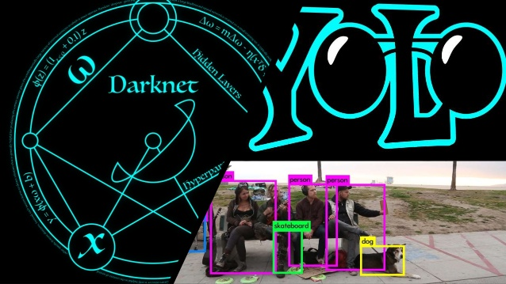
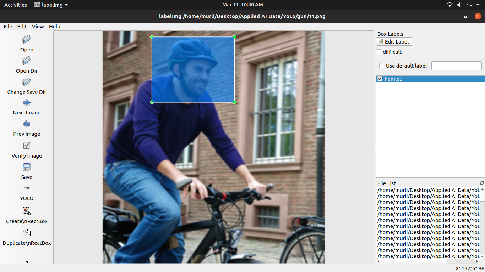

# Custom-Object-Detection-YoLo-V3

## Introduction
This notebook shows how object detection can be done on your own dataset by training YOLOv3. I am going to use Hemlmet images as training dataset as an example to detect Helmets. After finishing this notebook, you will be able to train your own model, and detect objects that you are interested in.

## Contents
1. How to prepare your own dataset
2. How to make your own configuration file
3. Folder Structure
4. How to make a prediction

## How to prepare your own dataset

Here I am using ImgLabel Software for labeling the image data. This software gives us a anchors in a YoLo predefined format so its easy to draw bounding boxes over the images.Annotating process generates a text file for each image, contains the object class number and coordination for each object in it, as this format "(object-id) (x-center) (y-center) (width) (height)" in each line for each object. Coordinations values (x, y, width, and height) are relative to the width and the height of the image. I hand-labeled them manually with, it is really a tedious task.

## How to make your own configuration file
We will need to modify the YOLOv3 tiny model (yolov3-tiny.cfg)(https://github.com/pjreddie/darknet/blob/master/cfg/yolov3-tiny.cfg) to train our custom detector. This modification includes:

Uncomment the lines 5,6, and 7 and change the training batch to 64 and subdivisions to 2.
Change the number of filters for convolutional layer "[convolution]" just before every yolo output "[yolo]" such that the number of filters= #anchors x (5 + #ofclasses)= 3x(5+1)= 18. The number 5 is the count of parameters center_x, center_y, width, height, and objectness Score. So, change the lines 127 and 171 to "filters=18".
For every yolo layer [yolo] change the number of classes to 1 as in lines 135 and 177.

Other files are needed to be created as "objects.names" which its name implies that it contains names of classes, and also the file "training.data" which contains parameters needed for training as described in the next table.

## Folder Structure
The most important part here is a folder structure. I use colab for training so my folder structure is as followes
 Data_for_colab ---> Data------>ALl training images.
                --->obj.name (contains the class names).
                --->obj.data (Contains the path of training and testing files).
                --->yolov3-tiny-obj.cfg (contains the YoLo model architecture).
                --->train and test.txt (contains the image paths).
              .
## How to make a prediction
